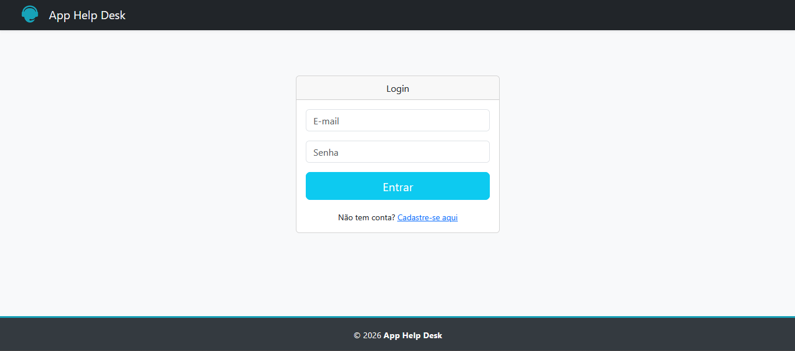
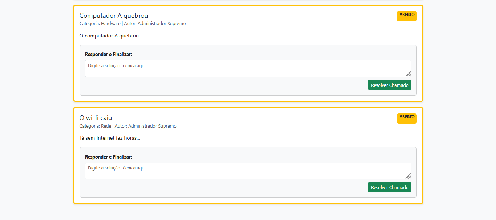
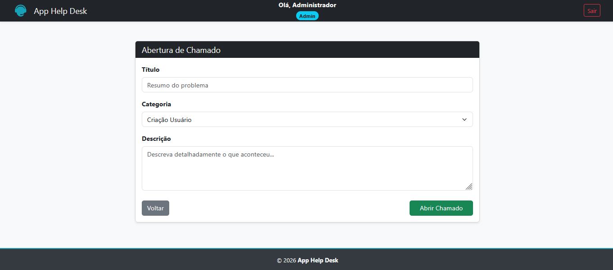
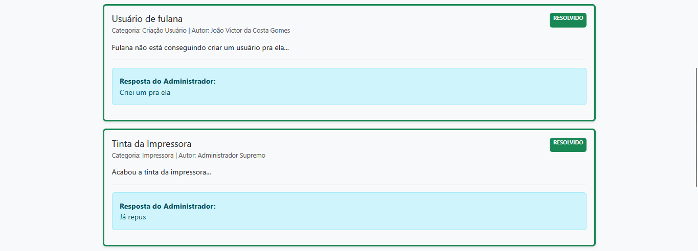

# Help Desk MVC

Um sistema de gerenciamento de chamados (Ticket System) desenvolvido em PHP utilizando a arquitetura MVC.

## Funcionalidades

### Autenticação & Segurança
- **Login e Cadastro:** Sistema completo de registro de usuários.
- **Hash de Senha:** Utilização de `password_hash` (Bcrypt) para segurança.
- **Sessões Seguras:** Proteção contra sequestro de sessão e acesso direto a arquivos.
- **Feedback Visual:** Mensagens de erro/sucesso (Flash Messages) para o usuário.

### Perfil Usuário
- Abrir novos chamados de suporte.
- Consultar histórico de chamados próprios.
- Excluir chamados que ainda estão "Abertos".
- Visualizar status (Aberto, Resolvido, Excluído).

### Perfil Administrador
- Visualizar chamados de **todos** os usuários.
- Responder chamados (a resposta fecha o ticket automaticamente).
- Identificação visual facilitada do status dos tickets.

---

## Screenshots

### 1. Login e Autenticação


### 2. Dashboard do Usuário (Meus Chamados)


### 3. Abertura de Chamado


### 4. Visão do Admin (Respondendo)


---

## Tecnologias Utilizadas

- **Back-end:** PHP 8+ (Sem frameworks).
- **Banco de Dados:** MySQL / MariaDB.
- **Front-end:** HTML5, CSS3, Bootstrap 5.
- **Gerenciador de Dependências:** Composer (para Autoload).
- **Servidor Local:** PHP Built-in Server.

---

## Estrutura do Projeto (MVC)

O projeto segue uma estrutura organizada para facilitar a manutenção:

```text
/
├── public/           # Arquivos públicos (index.php, CSS, JS)
├── src/
│   ├── Config/       # Configuração do Banco de Dados
│   ├── Controllers/  # Lógica de controle (Auth, Ticket)
│   └── Models/       # Acesso ao Banco (User, Ticket)
├── views/            # Telas do sistema (HTML/PHP)
├── screenshots/      # Imagens do README
└── vendor/           # Autoload do Composer
```

---

## Instalação Manual

Caso prefira rodar o projeto diretamente em sua máquina (usando XAMPP, Laragon ou PHP instalado manualmente), siga os passos abaixo:

### Pré-requisitos
- PHP 8.0 ou superior.
- MySQL 5.7 ou superior.
- Composer instalado.

### 1. Configuração do Banco de Dados
1. Crie um banco de dados no seu MySQL chamado `help_desk`.
2. Importe o arquivo `database/schema.sql` para criar as tabelas.
3. **Importante:** Como o arquivo SQL está limpo (sem usuários), execute o comando abaixo no seu banco para criar o administrador padrão:
   ```sql
   INSERT INTO usuarios (nome, email, senha, perfil) VALUES 
   ('Admin Local', 'admin@local.com', '$2y$10$gEBXoURoykApm/6QcPTukePXPPrrG9tAGtxg7va8O92wNYPvXMkby', 'admin');
   -- A senha do hash acima é: 123456

### 2. Instalação das Dependências
Abra o terminal na pasta raiz do projeto e execute:
```bash
composer install
```

### 3. Iniciando o Servidor
Para usar o servidor embutido do PHP, execute o comando abaixo **dentro da pasta public**:
```bash
php -S localhost:8080
```

### 4. Acessar
Abra no navegador: `http://localhost:8080`

- **Login:** admin@local.com

- **Senha:** 123456

---