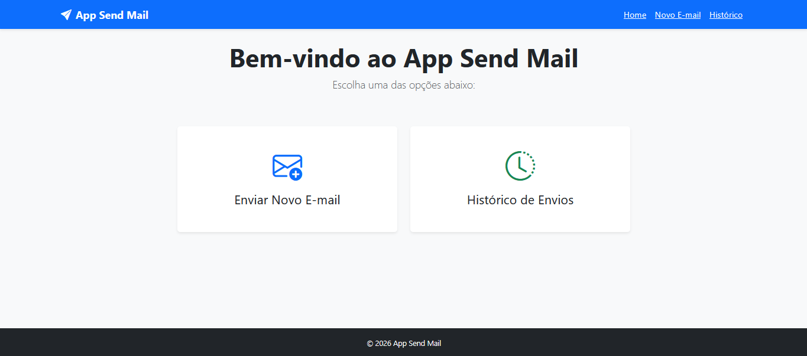
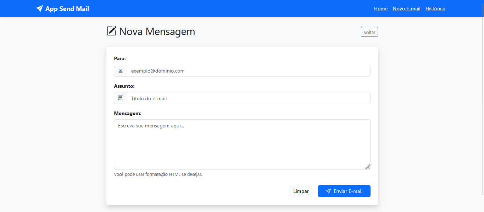
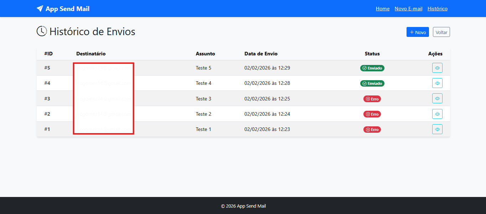

# 📧 Send Mail MVC

Um sistema para enviar e-mails e visualizar histórico de envios. Desenvolvido em PHP utilizando a arquitetura MVC. 


---

## 📸 Screenshots

### Tela Inicial (home.php)


### Tela de Envio de E-mail (new_email.php)


### Tela de Histórico de E-mails (history.php)


---

## 🚀 Funcionalidades

- **Envio de e-mails:** Integração segura com servidores reais (Gmail, Outlook, Mailtrap) usando PHPMailer.

- **Histórico de e-mails:** Armazenamento de todos os envios no banco de dados MySQL.


---

## 📂 Estrutura do Projeto

```text
/
├── composer.json       # Gerenciador de dependências (PHPMailer e PHPDoenv)
├── .env.example        # Modelo para suas variáveis de ambiente
├── database.sql        # Script SQL para criação da tabela
├── public/             # Ponto de entrada (index.php) e assets
├── src/
│   ├── Config/         # Configuração da conexão PDO com o Banco
│   ├── Controllers/    # Controladores que unem o Model e a View
│   ├── Models/         # Camada de acesso ao Banco de Dados (DAO)
│   └── Services/       # Serviço isolado para disparo de e-mail (Mailer)
├── views/              # Telas HTML/PHP (Templates e Partials)
├── screenshots/        # Imagens da documentação
└── vendor/             # Autoload do Composer
```

---